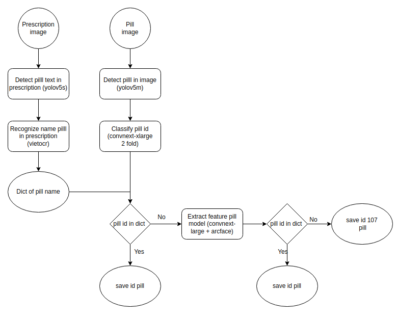

# vaipe-2022-solutions
### Pipeline
<!--


-->

<div align=center>

</div>

###  Install
Tạo docker image từ dockerfile và run docker container
```shell
docker build -t vaipe .
docker run -d -it --name ai4vn-teamVCintership -v [path to data root]:/app/data vaipe:latest
docker exec -it [container name] bash
```

###  Prepare data
Chuẩn bị dữ liệu train cho các task phát hiện và nhận dạng tên thuốc trong đơn, phát hiện và nhận dạng thuốc trong ảnh viên thuốc
Cấu trúc cây thư mục như sau:
```shell
---data/
    |---public_train/
    |---public_val/
    |---public_test/
    |---private_test/
```
Sau đó vào trong docker container, chạy lệnh sau để tạo ra dữ liệu đầu vào cho các phần training sau
```shell
bash scripts/install.sh
bash scripts/prepare.sh
```
Cấu trúc thư mục sau khi chạy như sau:
```shell
---data/
    |---public_train/
    |---public_test/
    |---private_test/
    |---crop/ # data dung de train va inference final model
        |---crop_train/
        |---crop_val/
        |---train_crop.csv
        |---val_crop.csv
---checkpoints/
    |---best.pt # weight yolov7 detect vien thuoc
    |---convnext_large_384_in22ft1k_224.ckpt
    |---convnext_xlarge_384_in22ft1k_224.ckpt
    |---drug_private.npy  # dict mapping ten thuoc
```

###  Training
Đối với task phát hiện tên thuốc trong đơn, training model yolov5s theo repo yolov5 với data ở folder pres_yolo thu được weight pres.pt

Đối với task nhận dạng tên thuốc: Training theo repo vietocr của anh pbcquoc với folder tên ocr đã tạo từ bước trước, thu được weight transformerocr.pth

Đối với task phát hiện vị trí viên thuốc trong ảnh, training model yolov5m theo repo yolov5 thu được weight pill_2.pt

Đối với model trích rút đặc trưng ảnh viên thuốc:
```shell
bash scripts/train.sh

Phần này mình chưa check được code kỹ, nếu không chạy được vui lòng đặt issue để mình update
```
###  Inference

```shell
bash scripts/inference.sh
```
Kết quả thu được là 1 file results.csv dùng để submit kết quả lên web của cuộc thi
