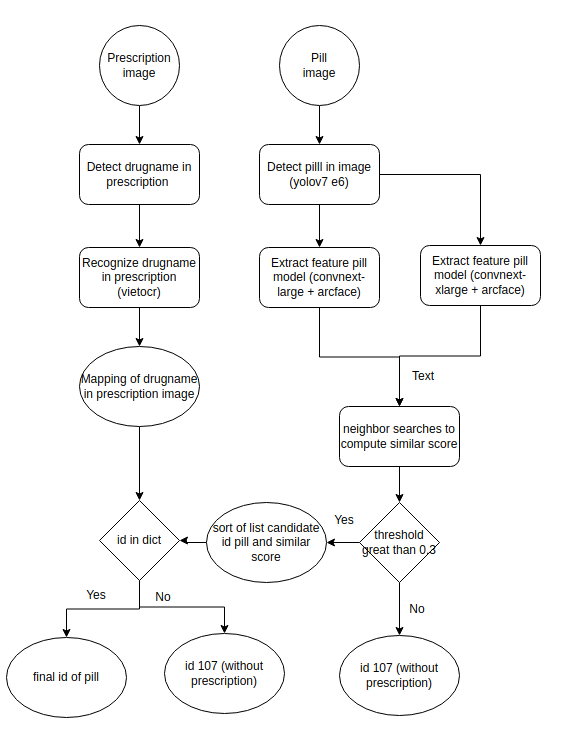

# vaipe-2022-solutions
### Pipeline
<!--


-->

<div align=center>

</div>

###  Install
Tạo docker image từ dockerfile và run docker container
```shell
docker build -t vaipe .
docker run -d -it --name ai4vn-teamVCintership -v [path to data root]:/app/data vaipe:latest
```

Bước này dùng để cài đặt các thư viện cần thiết và tải về các file trọng số của mô hình

###  Prepare data
Chuẩn bị dữ liệu train cho các task phát hiện và nhận dạng tên thuốc trong đơn, phát hiện và nhận dạng thuốc trong ảnh viên thuốc
Cấu trúc cây thư mục như sau:
```shell
---data/
    |---public_train/
    |---public_val/
        |---pubval_groundtruth.csv
    |---public_test/    
```
Sau đó chạy lệnh sau để tạo ra dữ liệu đầu vào cho các phần training sau
```shell
bash scripts/prepare.sh
```
Cấu trúc thư mục sau khi chạy như sau:
```shell
---data/
    |---public_train/
    |---public_test/
    |---public_test_new/
    |---ocr/  # Dung de training nhan dang ten thuoc
        |---pres_text_crop/
        |---pres_text.txt 
    |---pill_yolo_1class  # dung de training detect vien thuoc trong anh
    |---pres_yolo  # dung de training detect ten thuoc trong don
    |---pill_recog  # dung de training trich rut dac trung anh vien thuoc
    |---drug_dict.json  # map ten thuoc voi id thuoc
    |---cuong_mapping.json  # map cac thuoc co trong don voi anh don thuoc
    |---crop/ # data dung de train va inference final model
        |---crop_train/
        |---crop_val/
        |---crop_test/
        |---train_crop.csv
        |---val_crop.csv
        |---test_crop.csv
```
Dữ liệu quan trọng nhất dùng để inference final model nằm ở trong folder crop/crop_test chứa tập các ảnh viên thuốc sau khi cắt và crop/test_crop.csv chứa đường dẫn của ảnh, thu được sau khi chạy model detect pill ở lệnh prepare.sh, nên bắt buộc phải có 2 path này.

###  Training
Đối với task phát hiện tên thuốc trong đơn, training model yolov5s theo repo yolov5 với data ở folder pres_yolo thu được weight pres.pt

Đối với task nhận dạng tên thuốc: Training theo repo vietocr của anh pbcquoc với folder tên ocr đã tạo từ bước trước, thu được weight transformerocr.pth

Đối với task phát hiện vị trí viên thuốc trong ảnh, training model yolov5m theo repo yolov5 thu được weight pill_2.pt

Đối với model trích rút đặc trưng ảnh viên thuốc:
```shell
bash scripts/train.sh
```
###  Inference
Pipeline sử dụng mô hình trích rút đặc trưng dùng single model dựa trên backbone convnext-large + arcface đạt kết quả 0.63 trên tập val và pipeline kết hợp với mô hình classify đạt kết quả 0.64, do thời gian nộp code có hạn nên nhóm chưa thể merge code dựa trên pipeline 2

```shell
bash scripts/inference.sh
```
Kết quả thu được là 1 file results.csv dùng để submit kết quả lên web của cuộc thi
